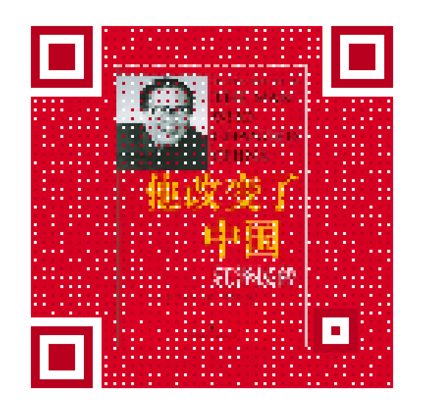

# UniqR - Get your UNIque QR code

Yet another QR art library for Java, combines image with QR code.

## Features

* This library is <sup><sub>super tiny</sub></sup>. Less than 10KB for integration (see notes)
* **0** runtime dependency (see notes)
* Separated platform implementations for JavaSE and Android
* Apache License, can be used in commercial projects

## Notes

* No QR encoder bundled for flexibility, you'll need to implement `QrData` classes with your favorite QR encoder
* You'll need to crop and adjust input image by yourself (especially for JavaSE implementation).
 For example, an image with aspect ratio other than 1:1 may be stretched.

## Example (in Kotlin)

````kotlin
class QrCodeData(private val qrCode: QrCode) : QrData {

    override fun getSize() = qrCode.size

    override fun getVersion() = qrCode.version

    override fun get(x: Int, y: Int) = qrCode.getModule(x, y) == 1
}

val background = ImageIO.read(Main::class.java.getResource("the_man_who_changed_china.png"))
val qrSegments = QrSegment.makeSegments("苟利国家生死以，岂因祸福避趋之")
val qrCode = QrCode.encodeSegments(qrSegments, QrCode.Ecc.HIGH, 5, 40, -1, true)
val uniqR = UniqR(JavaSEPlatform(), background, QrCodeData(qrCode)).apply {
    qrPatternColor = 0xFFB9001E
}

// Call uniqR.build() for result 
````

## Output



## Donation

**Donation methods**

PayPal & AliPay: `val email = "mariotaku.lee@gmail.com"`

Bitcoin: `1Ag37rPeVUKPHZa6RrsnbkCCz1Envx8xxZ`

Buy me a ~~bread~~ [game](http://steamcommunity.com/id/mariotaku/wishlist) or anything you want :)

---

Made with ❤️ by <a href="https://mariotaku.org/"></a>
